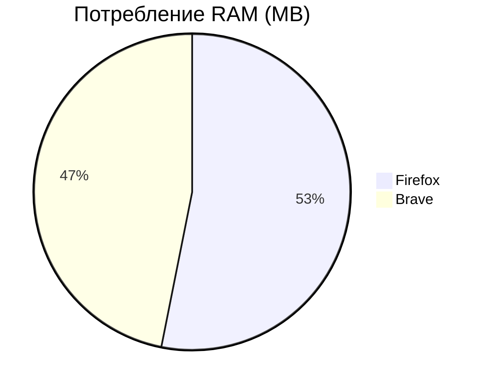
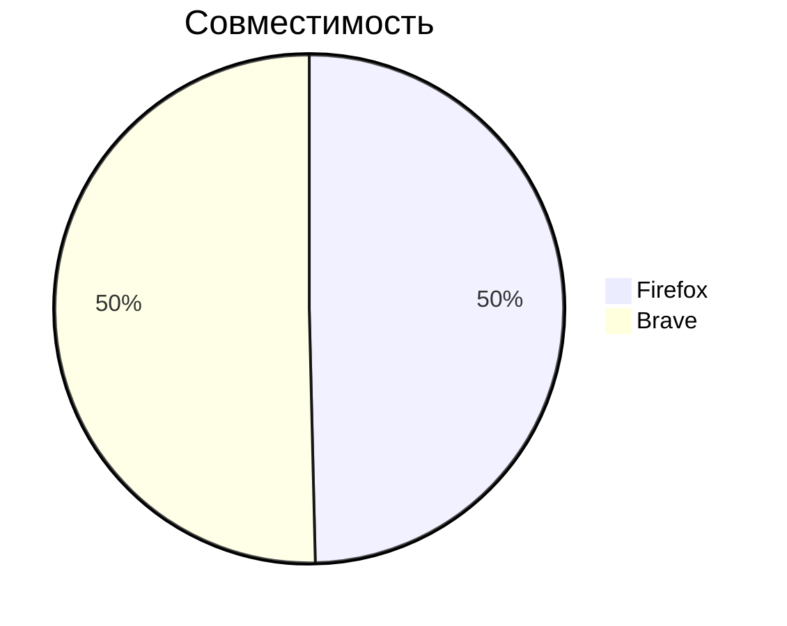
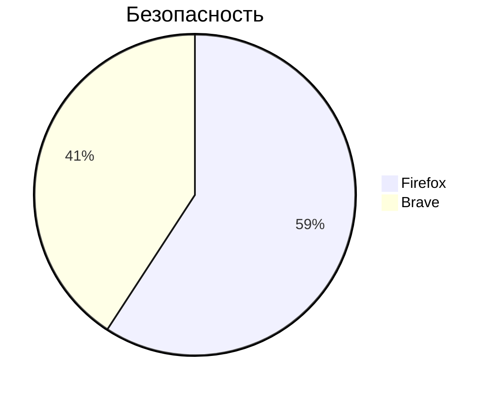
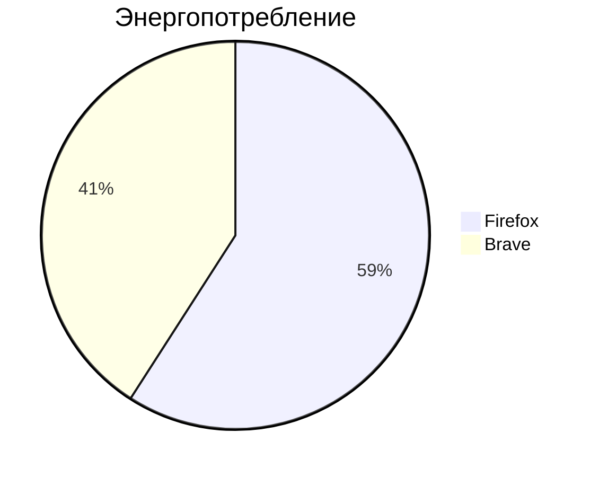

|Критерий         | Firefox | Brave  |
|-----------------|---------|--------|
|RAM (10 вкладок) | 1.7 GB  | 1.5 GB |
|Совместимость    | 522     | 530    |
|Безопасность     | 14500   | 10000  |
|Энергопотребление| 13%     | 9%     |

